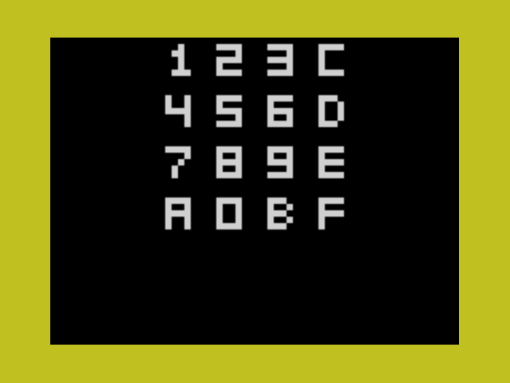

<!-- vim: set ft=markdown tw=80 cc=80: -->
# Chip 8

Links:

The Chip-8 virtual machine is described in the following links

- [Chip8 spec](http://devernay.free.fr/hacks/chip8/C8TECH10.HTM)
- [Chip8 opcodes](https://chip8.gulrak.net)

There are 3 example programs to try out.

- logo.ch8 Generates an IBM logo
- corax.ch8 Performs a suite of tests
- keypad.ch8 For testing the keypad

## Running

Once you have your `ch8` binaries on the retro, go ahead and do:

```text
C>chip8 logo.ch8

Press ESC to quit
```


## Graphics

The 6502-Retro! graphics is powered by a Pico9918a which in turn emulates a
TMS9918A Video Processing Device.  This chip was used in some retro computers
and consoles and I know it well.  Up until this project, however, I had never
done anything with the Multicolor mode.  Multicolor mode on this VDP is a bit
strange.  It divides an 8x8 pattern into 4 4x4 pixels which results in a screen
resolution of 64x48 with each pixel able to have it's own colour assignment.

As the Chip-8 display is 64x32 pixels, the multicolour mode seemed a perfect
choice.

Programming for this mode, however, it not as simple as it might seem.  You can
see the logic for plotting to XY in [vdp.c](./vdp.c)

## Keypad

The keypad is mapped like this:



```text
1 2 3 4
q w e r
a s d f
z x c v
```

As the 6502-Retro! does not have a directly attached keyboard it relies on the
serial interface for input.  This means that the keypad emulation is a bit
different to how it's meant to be.  The keys on this implimentation are toggle
keys.  Press `z` once to turn on and `z` again to turn it off.

## Audio [TODO]

The 6502-Retro! does support audio via the SN76489 PSG.  Chip-8 Audio is a
continuous beeper sound which sounds until the `sound` timer decrements until
zero.  Currently the 6502-Retro! OS managed sound time through an interrupt
generated by the VDP.  Happily, that is the same rate Chip-8 emulation should
run at so this task should not be too difficult.

## Bugs and Ommissions

The only untested feature at this time is the "WAIT FOR KEYPRESS" Fx0A
instruction.

None of the later enhancments or quirks are emulated.  I have stuck with the
instructions defined in the
[Cowgod's Chip-8 Technical Refernce v1.0 - Section 3.1](http://devernay.free.fr/hacks/chip8/C8TECH10.HTM#3.1)

